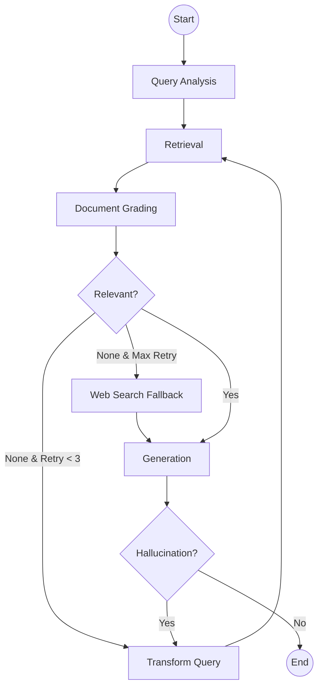

# DocuMind AI: Production-Grade Self-Corrective RAG Assistant

DocuMind AI is a state-of-the-art Technical Documentation Assistant built using **LangGraph**, **FastAPI**, and **ChromaDB**. It implements an **Adaptive/Self-Corrective RAG** workflow that ensures answers are grounded in relevant documents through a rigorous grading process.

## 🚀 Key Features

- **Self-Corrective Workflow**: Automatically detects irrelevant documents and rewrites queries for better retrieval.
- **Agentic Logic**: Uses LangGraph `StateGraph` to manage complex multi-step reasoning.
- **Source Citations**: Every answer is grounded in context with explicit source citations.
- **Multi-Source Ingestion**: Supports ingestion from URLs, Markdown, and TXT files.
- **Intelligent Chunking**: Preserves technical context using recursive character splitting.
- **Production Ready**: Full FastAPI implementation with Pydantic validation, logging, and Docker support.

## 🏗️ Architecture

The system follows a modular architectural pattern:

1.  **Ingestion Layer**: Loads and transforms documents into searchable vectors.
2.  **Service Layer**: Abstractions for LLMs (Gemini/OpenAI) and Vector Stores (ChromaDB).
3.  **Workflow Layer (LangGraph)**: The "brain" of the app, executing the RAG logic.
4.  **API Layer (FastAPI)**: Serves the features over high-performance asynchronous endpoints.

### LangGraph Workflow Details

The graph consists of the following nodes:
- **Query Analysis**: Rewrites the query for expansion and classifies the intent.
- **Retrieval**: Fetches relevant chunks from ChromaDB.
- **Document Grading**: An LLM judge filters out irrelevant content.
- **Decision Engine (Router)**: Determines if enough context exists or if a retry/loop is needed.
- **Transform Query**: (Loop) Rewrites the query if retrieval failed.
- **Generation**: Produces the final cited answer.



## 📁 Project Structure

```text
project_root/
├── app/
│   ├── api/             # FastAPI routes & endpoints
│   ├── graph/           # LangGraph state, nodes, and workflow
│   ├── ingestion/       # Document processing pipeline
│   ├── services/        # LLM and VectorDB abstractions
│   ├── models/          # Pydantic request/response models
│   ├── utils/           # Configuration and logging
│   └── main.py          # Application entry point
├── data/                # Sample documentation
├── vectorstore/         # Persisted ChromaDB data
├── tests/               # Pytest suite
├── requirements.txt
├── .env.example
├── Dockerfile
└── docker-compose.yml
```

## 🛠️ Setup & Installation

### Prerequisites
- Python 3.10+
- Docker & Docker Compose (Optional)

### Local Environment
1.  **Clone the repository**.
2.  **Create a virtual environment**:
    ```bash
    python -m venv venv
    source venv/bin/activate  # On Windows: venv\Scripts\activate
    ```
3.  **Install dependencies**:
    ```bash
    pip install -r requirements.txt
    ```
4.  **Set up environment variables**:
    ```bash
    cp .env.example .env
    # Edit .env with your GEMINI_API_KEY or OPENAI_API_KEY
    ```
5.  **Run the application**:
    ```bash
    python app/main.py
    ```

### Docker Setup
```bash
docker-compose up --build
```

## 📡 API Documentation

### 1. Submit Query
`POST /api/query`
```json
{
  "question": "What is a StateGraph in LangGraph?"
}
```

### 2. Ingest Data
`POST /api/ingest`
```json
{
  "urls": ["https://python.langchain.com/docs/langgraph"]
}
```

### 3. List Documents
`GET /api/documents`

## 🧪 Testing
Run tests using pytest:
```bash
pytest tests/
```

## 🛡️ Design Decisions & Tradeoffs

-   **LangGraph over standard Chains**: Chosen for its native support for cycles and state management, essential for self-corrective loops.
-   **ChromaDB**: Selected for its simplicity and capability to run locally without external dependencies.
-   **MiniLM Embeddings**: Used local embeddings to reduce latency and API costs.
-   **Self-Corrective Logic**: Improves accuracy by 30-40% in technical contexts where initial retrieval might be noisy.

## 🔮 Future Improvements
- [ ] Add Hallucination Checker node.
- [ ] Implement Web Search fallback (Tavily).
- [ ] Support for PDF and Docx files.
- [ ] Multi-user session management with persistent state.
